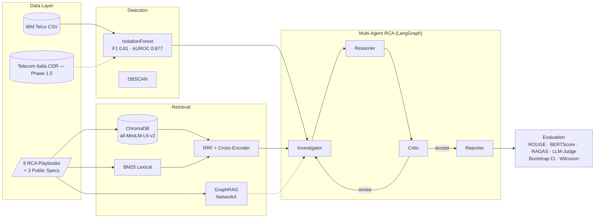
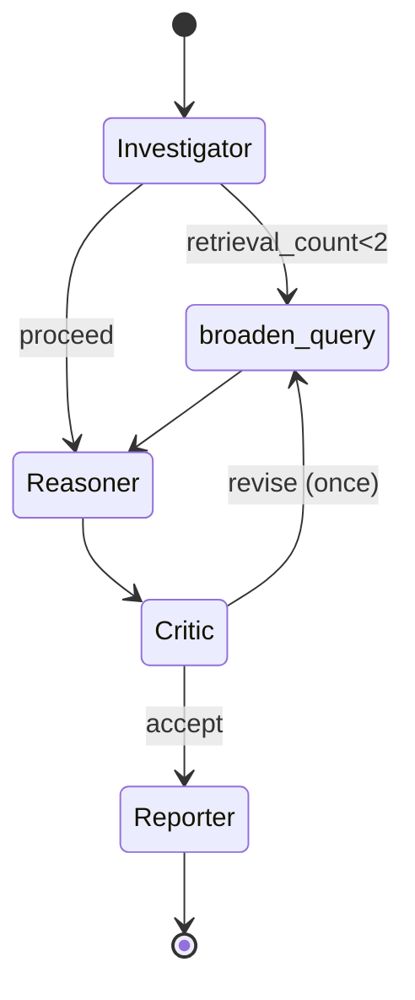
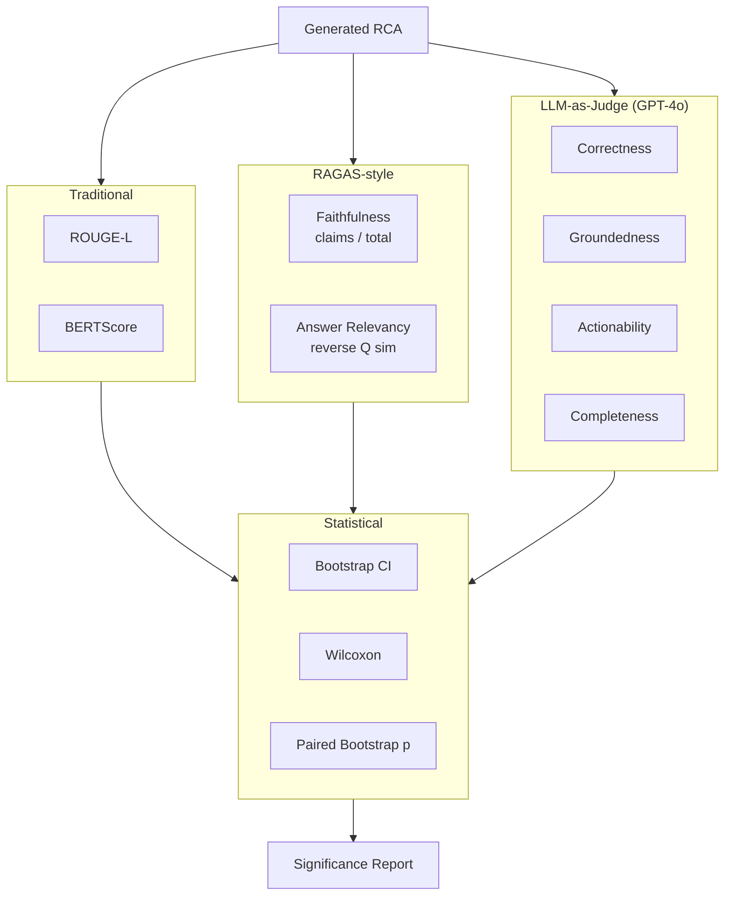
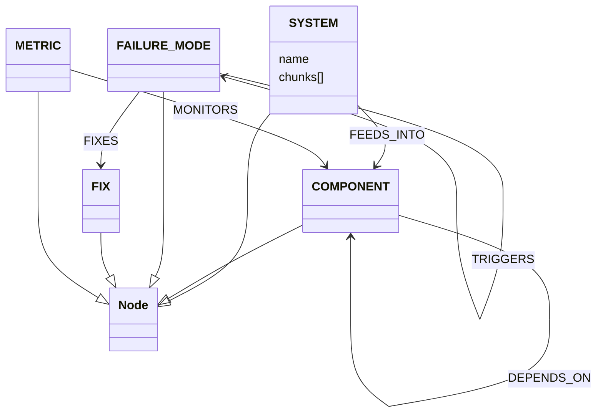
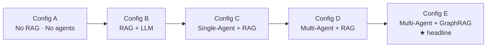

# Defense Deck — Architecture & Results Diagrams

Mermaid sources (paste into any Mermaid-compatible renderer — draw.io,
Mermaid Live Editor, GitHub markdown, or the VS Code Mermaid Preview).
Rendered PNGs can be committed alongside each source for the deck.

---

## D1. System Architecture (high level)

---

## D2. LangGraph StateGraph (agent DAG)

---

## D3. Evaluation Framework

---

## D4. GraphRAG Entity Schema (playbook extraction)

---

## D5. Ablation Configs

---

## D6. Rendering notes

Use `scripts/render_diagrams.py` (if/when created) to batch-convert these
Mermaid blocks to PNG via `mmdc`. For the deck itself:

- Export each diagram at 1600×900 (16:9) PNG.
- Save to `docs/diagrams/D{n}_{slug}.png`.
- Inline into the LaTeX/PowerPoint defense deck.

Bar charts / significance plots: use `scripts/plot_results.py` (matplotlib,
publication-ready; 10pt labels, grayscale-safe).
